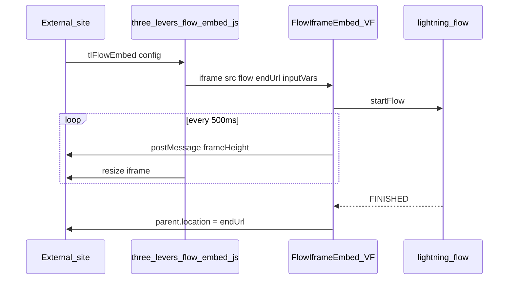

# Lightning Flow iFrame

Embed **Salesforce Lightning Screen Flows** on external websites (WordPress, marketing pages, static sites) with dynamic iframe height, optional flow inputs from the URL, and redirect when the flow finishes.

[](LICENSE)
[](https://developer.salesforce.com)

- **Product docs:** [threelevers.com/support/products/lightning-flow-iframe/](https://threelevers.com/support/products/lightning-flow-iframe/)
- **JavaScript widget:** [support guide](https://threelevers.com/support/products/lightning-flow-iframe/javascript/)
- **Support:** [Contact support](https://threelevers.com/support/contact-support/)

---

## Features

- Run any Screen Flow via query param `flow` (Developer Name)
- **Dynamic height** — Visualforce page posts `frameHeight` to the parent every 500ms
- **Flow inputs** — only URL params listed in `inputVars` are passed (String)
- **Finish redirect** — `endUrl` navigates the parent window when status is `FINISHED`
- **Unlocked 2GP package** — customize the Visualforce page and `--fie-*` CSS variables after install
- **Parent widget** — [`embed/three-levers-flow-embed.js`](embed/three-levers-flow-embed.js) builds the iframe URL and handles resize

---

## Architecture



| Component | Description |
|-----------|-------------|
| `three-levers-flow-embed.js` | Parent-page script (this repo `embed/`) |
| `FlowIframeEmbed` | Visualforce page on a Salesforce Site |
| `three_levers:FlowOut` | Lightning Out Aura app (`lightning:flow`) |

---

## Quick start

1. **Install** the unlocked package ([Install](#install-package)) or deploy from source ([docs/INSTALL.md](docs/INSTALL.md)).
2. **Create** a Screen Flow and note its API **Developer Name**.
3. **Expose** `FlowIframeEmbed` on a **Salesforce Site**; configure guest access and clickjack/CSP for your parent domain.
4. Copy your Site URL to the page, e.g. `https://your-site.force.com/prefix/FlowIframeEmbed`.
5. On your website, add the [embed script](#embed-on-your-website) with `embedUrl` and `flow`.

---

## Install package

**Version `1.1.0-2` (released)** · Subscriber version Id `04tgL000000GUerQAG`

| Org | URL |
|-----|-----|
| Production | https://login.salesforce.com/packaging/installPackage.apexp?p0=04tgL000000GUerQAG |
| Sandbox | https://test.salesforce.com/packaging/installPackage.apexp?p0=04tgL000000GUerQAG |

```bash
sf package install --package 04tgL000000GUerQAG --target-org <alias>
```

**Deploy from source:** see [docs/INSTALL.md](docs/INSTALL.md).

---

## Embed on your website

```html
<div id="tl-flow-embed"></div>

<script>
  window.tlFlowEmbed = {
    embedUrl: 'https://your-site.force.com/site-prefix/FlowIframeEmbed',
    flow: 'Check_In_Dispatch',
    endUrl: 'https://yoursite.com/thanks',
    inputVars: ['recordId', 'source'],
    params: { recordId: '001xxx', source: 'homepage' },
    height: '75px',
    ease: true,
    allowedOrigin: 'https://your-site.force.com'
  };
</script>
<script src="https://cdn.jsdelivr.net/gh/jason-best/lightning-flow-iframe@1.0.0/embed/three-levers-flow-embed.js"></script>
```

More examples: [docs/EMBED.md](docs/EMBED.md) · Local demo: [examples/embed-demo.html](examples/embed-demo.html)

## WordPress

The **Lightning Flow iFrame** plugin (shortcode `[Lightning-Flow-iFrame]`) lives in [`wordpress/lightning-flow-iframe/`](wordpress/lightning-flow-iframe/). Install by zipping that folder and uploading it under **Plugins → Add New → Upload Plugin**.

Full instructions: [docs/WORDPRESS.md](docs/WORDPRESS.md) (settings page, bare `[Lightning-Flow-iFrame]` shortcode, embed vs legacy modes).

New WordPress sites should prefer embed mode via plugin defaults or explicit `flow` on the shortcode.

### CDN (jsDelivr)

| URL | Use |
|-----|-----|
| `https://cdn.jsdelivr.net/gh/jason-best/lightning-flow-iframe@1.0.0/embed/three-levers-flow-embed.js` | Pinned release |
| `https://cdn.jsdelivr.net/gh/jason-best/lightning-flow-iframe@latest/embed/three-levers-flow-embed.js` | Latest GitHub release |

---

## `tlFlowEmbed` options

| Property | Required | Default | Description |
|----------|----------|---------|-------------|
| `embedUrl` | Yes | — | Site URL to **FlowIframeEmbed** (no query) |
| `flow` | Yes | — | Flow Developer Name |
| `endUrl` | No | — | Parent redirect when flow finishes |
| `inputVars` | No | — | Array or comma-separated allowlist for flow inputs |
| `params` | No | `{}` | Flow input values (keys must be in `inputVars`) |
| `container` | No | `#tl-flow-embed` | Mount selector or element |
| `height` | No | `75px` | Initial iframe height |
| `heightPadding` | No | `20` | Pixels added to `frameHeight` |
| `ease` | No | `false` | Animate height changes |
| `easeSpeed` | No | `0.2` | Transition seconds |
| `lazy` | No | `false` | `loading="lazy"` on iframe |
| `allowedOrigin` | No | — | Restrict `postMessage` origin |
| `title` | No | `Salesforce Flow` | iframe `title` |

`window.tlFlowEmbedInfo` exposes version and documentation URLs after the script loads.

---

## Iframe URL parameters

Set on the Salesforce Site URL (iframe `src`):

| Parameter | Required | Description |
|-----------|----------|-------------|
| `flow` | Yes | Flow Developer Name |
| `endUrl` | No | Parent redirect on finish |
| `inputVars` | No | Comma-separated allowlist; if omitted, no params go to the flow |
| other | No | Flow inputs only when listed in `inputVars` |

Example:

```text
.../FlowIframeEmbed?flow=New_Customer_Flow&inputVars=recordId,source&recordId=001xxx&source=web
```

---

## Styling

Edit CSS variables (`--fie-*`) in the **FlowIframeEmbed** Visualforce page after install. System fonts only; no external font CDN.

---

## Migration from legacy `ifc` widget

Older integrations used `ifc.iframeurl`, `ifc.endurl`, and auto-appended the parent page query string ([legacy docs](https://threelevers.com/support/products/lightning-flow-iframe/javascript/)).

| Legacy | Current |
|--------|---------|
| `ifc.iframeurl` | `embedUrl` |
| (flow in old VF URL) | `flow` (required) |
| `ifc.endurl` | `endUrl` |
| `ifc.extraqs` | `params` + `inputVars` |
| Parent QS auto-forward | Explicit `params` only |

---

## Repository layout

```text
embed/three-levers-flow-embed.js    Parent-page widget
force-app/main/default/             FlowIframeEmbed, FlowOut, static resources
wordpress/lightning-flow-iframe/    Legacy WordPress plugin (shortcode)
manifest/package.xml                Unpackaged deploy manifest
docs/                               INSTALL, EMBED, PACKAGING, WORDPRESS
examples/embed-demo.html            Local test page
```

---

## Development

```bash
git clone https://github.com/jason-best/lightning-flow-iframe.git
cd lightning-flow-iframe
sf org create scratch --definition-file config/project-scratch-def.json --alias flow-embed-scratch --duration-days 7
sf project deploy start --manifest manifest/package.xml --target-org flow-embed-scratch
```

Maintainers: see [SYNC.md](SYNC.md) for syncing from the private ThreeLeversDevOrg monorepo.

---

## Documentation and support

- [Product overview](https://threelevers.com/support/products/lightning-flow-iframe/)
- [JavaScript widget](https://threelevers.com/support/products/lightning-flow-iframe/javascript/)
- [Querystring variables](https://threelevers.com/support/products/lightning-flow-iframe/querystring-variables/)
- [Finish URL](https://threelevers.com/support/products/lightning-flow-iframe/finish-url/)
- [Salesforce setup](https://threelevers.com/support/products/lightning-flow-iframe/salesforce-setup/)
- [WordPress plugin](docs/WORDPRESS.md) (in-repo)
- [Contact](https://threelevers.com/contact/)

---

## License

[BSD 3-Clause License](LICENSE) — Copyright (c) 2026 Three Levers
